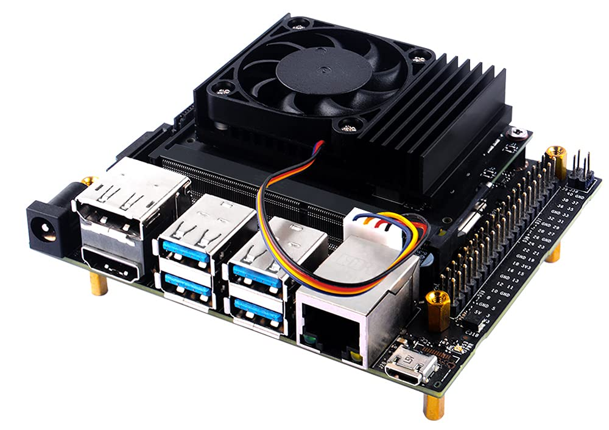

# Jetson Fan Control

<p align="center">
  
</p>

- Jetson Fan Control is a tool designed to manage fan speeds for the Nvidia Jetson Nano, ensuring optimal thermal performance while maintaining a quiet operation.
- This provides a comprehensive guide on setting up, installing, and customizing the fan control system.

## Requirements

To utilize Jetson Fan Control effectively, you'll need:

- [Jetson Nano Aluminum Heatsink with PWM Speed Adjustment](https://www.amazon.com/GeeekPi-Aluminum-Adjustment-40x40x7mm-Developer/dp/B098Q4VF4H)
- The fan of this radiator can be automatically controlled by the Jetson Nano system and the fan rotation can be controlled through the FAN J15 pin

## Installation

1. Run the installation script:

   ```sh
   sudo ./install.sh
   ```

   This script ensures the fan control system starts automatically at boot.

## Customization

To tailor fan control settings to your preferences, follow these steps:

1. Open the configuration file:

   ```sh
   sudo nano /etc/automagic-fan/config.json
   ```

2. Adjust the following parameters according to your needs:

   ```json
   {
       "FAN_OFF_TEMP": 20,
       "FAN_MAX_TEMP": 50,
       "UPDATE_INTERVAL": 2,
       "MAX_PERF": 1
   }
   ```

   - `FAN_OFF_TEMP`: Temperature (°C) below which the fan is turned off.
   - `FAN_MAX_TEMP`: Temperature (°C) above which the fan operates at 100% speed.
   - `UPDATE_INTERVAL`: Update interval for fan speed (in seconds).
   - `MAX_PERF`: Values greater than 0 maximize system performance by setting CPU and GPU clock speeds to the maximum.
3. Save changes and exit the editor.
4. Reboot the system to apply the new settings.
   Alternatively, restart the fan control service:

   ```sh
   sudo service automagic-fan restart
   ```

   **Troubleshooting:**

   If encountering issues, use the following command to check the status:

   ```bash
   sudo service automagic-fan status
   ```
